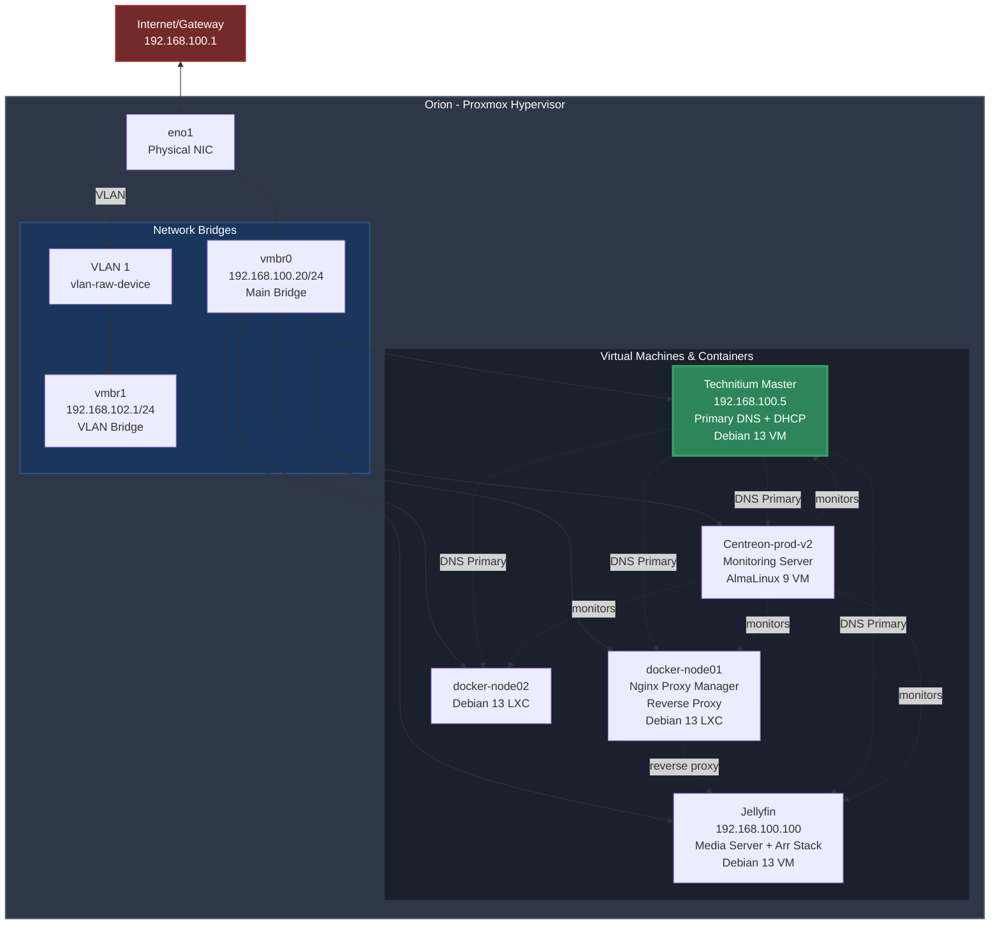

# Homelab

🫀 https://youtu.be/yoFTL0Zm3tw?si=L8GFws0YiC2Ms9ER

## Infrastructure

For my homelab, I use KISS (Keep it simple, stupid!) principle as much as possible.

**orion**:

```shell
         .://:`              `://:.            root@orion
       `hMMMMMMd/          /dMMMMMMh`          ----------
        `sMMMMMMMd:      :mMMMMMMMs`           OS: Proxmox VE 9.0.11 x86_64
`-/+oo+/:`.yMMMMMMMh-  -hMMMMMMMy.`:/+oo+/-`   Host: 12TES0G72C ThinkCentre M70q Gen 5
`:oooooooo/`-hMMMMMMMyyMMMMMMMh-`/oooooooo:`   Kernel: 6.14.11-4-pve
  `/oooooooo:`:mMMMMMMMMMMMMm:`:oooooooo/`     Uptime: 21 hours, 18 mins
    ./ooooooo+- +NMMMMMMMMN+ -+ooooooo/.       Packages: 1131 (dpkg)
      .+ooooooo+-`oNMMMMNo`-+ooooooo+.         Shell: bash 5.2.37
        -+ooooooo/.`sMMs`./ooooooo+-           CPU: Intel i5-14400T (16) @ 4.500GHz
          :oooooooo/`..`/oooooooo:             GPU: Intel Alder Lake-S GT1 [UHD Graphics 730]
          :oooooooo/`..`/oooooooo:             Memory: 8524MiB / 15622MiB
        -+ooooooo/.`sMMs`./ooooooo+-
      .+ooooooo+-`oNMMMMNo`-+ooooooo+.
    ./ooooooo+- +NMMMMMMMMN+ -+ooooooo/.
  `/oooooooo:`:mMMMMMMMMMMMMm:`:oooooooo/`
`:oooooooo/`-hMMMMMMMyyMMMMMMMh-`/oooooooo:`
`-/+oo+/:`.yMMMMMMMh-  -hMMMMMMMy.`:/+oo+/-`
        `sMMMMMMMm:      :dMMMMMMMs`
       `hMMMMMMd/          /dMMMMMMh`
         `://:`              `://:`
```

## Diagram



## Services: 

None of these services are publicly available. I access everything using tailscale when not in localhost.

| Host | Service | IP |
|---|---|---|
| technitium-dns | technitium | 192.168.100.5 |
| centreon-prod-v2 | Centreon Central (Monitoring server) | 192.168.100.7 |
| jellyfin | Jellyfin Media Server + arr-stack | 192.168.100.100 |
| docker-node01 | Nginx Proxy Manager, myapps (homarr), syncthing | 192.168.100.8 |
| docker-node02 | Dev of node01, for testing | 192.168.100.11

